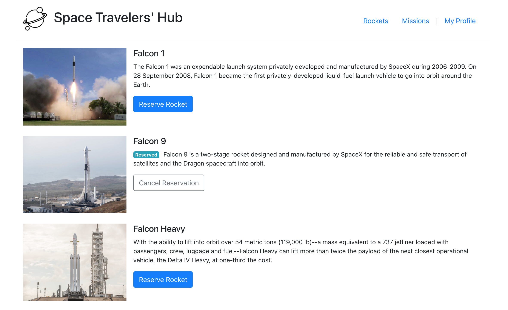
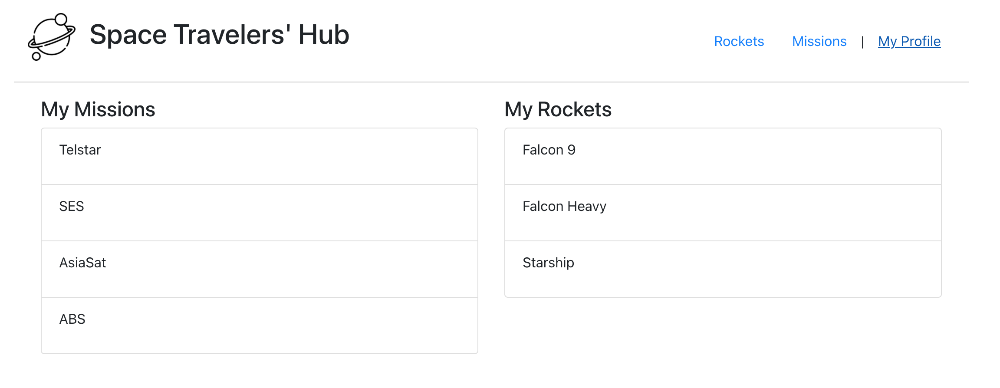

# space-travellers-hub
In this project, we will be working with the real live data from the SpaceX API to build a web application for a company that provides commercial and scientific space travel services. This application will allow users to book rockets and join selected space missions.

<!-- <a name="readme-top">The leaderboard website displays scores submitted by different players. It also allows you to submit your score. All data is preserved thanks to the external Leaderboard API service (https://www.notion.so/microverse/Leaderboard-API-service-24c0c3c116974ac49488d4eb0267ade3).</a> -->

<h1>React & Redux group project - Space Travelers' Hub</h1>

<!-- TABLE OF CONTENTS -->
# 📗 Table of Contents

- [space-travellers-hub](#space-travellers-hub)
- [📗 Table of Contents](#-table-of-contents)
- [📖 Space Travelers' Hub](#-space-travelers-hub)
    - [How to build the "Space Travelers' Hub" application?](#how-to-build-the-space-travelers-hub-application)
      - [Rockets /Dragons](#rockets-dragons)
      - [Missions](#missions)
      - [My Profile](#my-profile)
    - [Projects list](#projects-list)
  - [🛠 Built With ](#-built-with-)
    - [Tech Stack ](#tech-stack-)
    - [Tools i have used for this project ](#tools-i-have-used-for-this-project-)
    - [Key Features ](#key-features-)
  - [🚀 Live Demo ](#-live-demo-)
  - [💻 Getting Started ](#-getting-started-)
    - [Prerequisites](#prerequisites)
    - [Setup](#setup)
    - [Install](#install)
    - [Usage](#usage)
    - [Run tests](#run-tests)
    - [Deployment](#deployment)
  - [👥 Authors ](#-authors-)
  - [🔭 Future Features ](#-future-features-)
  - [🤝 Contributing ](#-contributing-)
  - [⭐️ Show your support ](#️-show-your-support-)
  - [🙏 Acknowledgments ](#-acknowledgments-)
  - [📝 License ](#-license-)

<!-- PROJECT DESCRIPTION -->
# 📖 Space Travelers' Hub<a name="about-project"></a>
Space Traveler's Hub is a website that working with the real live data from SpaceX API to build a web application for a company that provides commercial and scientific space travel services. This application will allow users to book rockets and join selected space missions.

<!-- > Describe your project in 1 or 2 sentences. -->
### How to build the "Space Travelers' Hub" application?
The Space Travelers' Hub consists of Rockets, Missions, and the My Profile section.

#### Rockets /Dragons
The Rockets section displays a list of all available SpaceX rockets. Users can book each rocket by clicking the reservation button or cancel the previously made booking. 
<p align="center">
  
</p>

#### Missions
The Missions section displays a list of current missions along with their brief description and participation status. There is also a button next to each mission that allows users to join the selected mission or leave the mission the user joined earlier.
<p align="center">
  
</p>

#### My Profile
The My Profile section displays all reserved rockets and space missions.
<p align="center">
  
</p>

### Projects list
- Config & Basic Project Setup: 
  * Create React App
  * Install [React Redux](https://react-redux.js.org/), [Redux Logger](https://www.npmjs.com/package/redux-logger) and [React Router](https://reactrouter.com/web/guides/quick-start).
  * Download the [free image](https://www.flaticon.com/free-icon/planet_3212567?term=space&page=1&position=19&page=1&position=19&related_id=3212567&origin=style) for the app logo.
  * Create routes and view components: rockets, missions, my profile.
    * Use <NavLink /> for the page navigation links and style active class to indicate which section/page user is currently on (underline active navigation link).
  * Create directories for all Redux state slice files:rockets, missions.

- Redux: Fetch data and update Redux store
  * Upon first render fetch data from the SpaceX API endpoints:
    * Rockets: https://api.spacexdata.com/v4/rockets
    * Missions: https://api.spacexdata.com/v3/missions
  * Once the data are fetched, dispatch an action to store the selected data in Redux store:
  * Rockets:
    * id
    * rocket_name
    * description
    * flickr_images
  * Missions:
    * mission_id
    * mission_name
    * description

- Render UI:lists
  * - Use `useSelector()` Redux Hook to select the state slices and render lists of rockets and missions in corresponding routes. i.e.:

  ```javascript
  // get rockets data from the store
  const rockets = useSelector((state) => state.rockets)
  ```

  * Style the whole application "by hand" or you could use [React Bootstrap](https://react-bootstrap.github.io/), a UI library that could speed up the process. This is a popular library and working with its components would be good practice.
  * Render a list of rockets (as per design). For the image of a rocket use the first image in the array of `flickr_images`.
  * Render a table with the missions' data (as per design).
  
- Redux: Write actions and reducers for booking rockets/dragons and joining missions
  * When a user clicks the "Reserve rocket" button action needs to be dispatched to update the store. You need to get the ID of the reserved rocket and update the state. Remember you mustn't mutate the state. Instead, you need to return a new state object with all rockets, but the selected rocket will have an extra key `reserved` with its value set to `true`. You could use a JS `filter()` or `map()` to set the value of the new state - i.e.:

  ```javascript
    const newState = state.map((rocket) => {
      if (rocket.id !== id) return rocket
      return { ...rocket, reserved: true }
    })
  ```

  * Place all the logics in the reducer. In the React view file, should only dispatch the action with the correct rocket ID as an argument.
  * Create a reducer and action dispatcher for the "Join Mission" button. The logic here is practically the same as with rockets - you need to pass the mission's ID to the corresponding action and update the missions' state with the selected mission having a new key/value - `reserved: true`.

- Redux: Write actions and reducers for canceling rockets/dragons and leaving missions
  * Here you need to follow the same logic as with the "Reserve rocket"/"Reserve dragon" and "Join mission" - but you need to set the `reserved` key to `false`.
  * Dispatch these actions upon click on the corresponding buttons.

- Render UI: conditional components rendering
  * Rockets that have already been reserved should show a "Reserved" badge and "Cancel reservation" button instead of the default "Reserve rocket" (as per design) .
  * Dragons that have already been reserved should show a "Reserved" badge and "Cancel reservation" button instead of the default.
  * Missions that the user has joined already should show a badge "Active Member" instead of the default "NOT A MEMBER" and a button "Leave Mission" instead of the "Join Mission" button (as per design).
  * Rockets/Dragons and Missions should use the React conditional rendering syntax:

  ```javascript
  {rocket.reserved && (
      // render Cancel Rocket button
  )}
  ```
- Render UI: My Profile section
  * Compose two/three column layout and list ONLY the rockets/dragons reserved and missions joined by the user (as per design):
    * Render a list of all joined missions (use `filter()`).
    * Render a list of all reserved rockets (use `filter()`).

- Technical set up\*\*
  * Set up the repository on GitHub and use Gitflow.
  * Set up React and Redux.
  * Set up testing libraries(React Testing Library and Jest).
  * Do not preserve user data.
  

NOTE: Make sure to add test for all your components and functions.
NOTE: Make sure only dispatch those actions once and do not add data to store on every re-render (i.e. when changing views / using navigation). 
NOTE: Rockets is the default view, so must fetch rockets data when the application starts. However, the missions data should only be fetched (once) when a user navigates to the Missions section.

## 🛠 Built With <a name="built-with"></a>

### Tech Stack <a name="tech-stack"></a>

<!-- > Describe the tech stack and include only the relevant sections that apply to your project. -->
<details>
  <summary>Client Side / Front-End</summary>
  <ul>
    <li><a href="https://www.w3.org/html/">HTML</a></li>
    <li><a href="https://www.w3.org/Style/CSS/">CSS</a></li>
    <li><a href="https://www.javascript.com/">Javascript</a></li>
    <li><a href="https://create-react-app.dev/">React</a></li>
    <li><a href="https://reactrouter.com/">React Router</a></li>
  </ul>
</details>

<details>
  <summary>Server Side / Back-End</summary>
  <ul>
    <li><a href="https://www.json.org/json-en.html">JSON</a></li>
    <li><a href="https://nodejs.org/en/">Node.js</a></li>
    <!-- <li><a href="https://www.npmjs.com/package/big.js">big.js</a></li> -->
    <!-- <li><a href="https://api-ninjas.com/api/quotes">API Ninjas</a></li> -->
    <!-- <li><a href=""> - </a></li>
    <li><a href=""> - </a></li> -->
  </ul>
</details>

<details>
    <summary>Package, Library, Framework</summary>
      <ul>
        <li><a href="https://jestjs.io/">Jest</a></li>
      </ul>
  </details>

<!-- Features -->
### Tools i have used for this project <a name="tools"></a>
  <details>
    <summary>Code Convention, Code Analysis</summary>
      <ul>
        <li><a href="https://eslint.org/">ESLint</a></li>
        <li><a href="https://webhint.io/">Webhint</a></li>
        <li><a href="https://stylelint.io/">Stylelint</a></li>
        <li><a href="https://chrome.google.com/webstore/detail/lighthouse/blipmdconlkpinefehnmjammfjpmpbjk?hl=en">Lighthouse</a></li>
        <li><a href="https://www.npmjs.com/package/npm-check">node_modules checker</a></li>
      </ul>
  </details>
  <details>
    <summary>Version Control, CI/CD, Hosting Service</summary>
      <ul>
        <li><a href="https://www.atlassian.com/git/tutorials/comparing-workflows/gitflow-workflow">GitFlow</a></li>
        <li><a href="https://pages.github.com/">Github Pages</a></li>
        <li><a href="https://github.com/features/actions">Github Actions</a></li>
        <li><a href="https://git-scm.com/">Git</a></li>
      </ul>
  </details>
  <details>
    <summary>IDE, Desktop Apps, Other Tools</summary>
      <ul>
        <li><a href="https://code.visualstudio.com/">Visual Studio Code</a></li>
        <li><a href="https://desktop.github.com/">Github Desktop</a></li>
        <!-- <li><a href="https://www.figma.com/">Figma</a></li> -->
      </ul>
  </details>

### Key Features <a name="key-features"></a>

<!-- > Describe between 1-3 key features of the application. -->
- fetch data and update redux store
- render UI lists


<p align="right">(<a href="#readme-top">back to top</a>)</p>

<!-- LIVE DEMO -->
## 🚀 Live Demo <a name=""></a>

<!-- > Add a link to your deployed project. -->
<!-- - Click the following url for [... Live Demo ...](https://react-redux-group-project-green.vercel.app/) -->

<p align="right">(<a href="#readme-top">back to top</a>)</p>

<!-- GETTING STARTED -->
## 💻 Getting Started <a name="getting-started"></a>

<!-- > Describe how a new developer could make use of your project. -->
To get a local copy up and running, follow these steps.

### Prerequisites

In order to run this project you need:
- git version 2.38.x
- node.js version > 12.x
- IDE (visual studio code, etc)
- browser (chrome, firefox, edge, safari)
- install the dependencies

### Setup

Clone this repository to your desired folder:

```sh
  cd space-travellers-hub
  git git@github.com:fickryiman/space-travellers-hub.git
```


### Install

Install this project with:

```sh
  cd space-travellers-hub
  npm install
```

### Usage

To run the project, execute the following command:

```sh
  npm run build (production environment)
  npm start (development environment)
```
Runs the app in the development mode.\
Open [http://localhost:3000](http://localhost:3000) to view it in your browser.

The page will reload when you make changes.\
You may also see any lint errors in the console.


### Run tests

To run tests, run the following command:
Run Github Actions Test
```sh
  npm test

  npx stylelint "**/*.{css,scss}"
  npx eslint "**/*.{js,jsx}"

  auto fix linter with --fix
  npx stylelint "**/*.{css,scss}" --fix
  npx eslint "**/*.{js,jsx}" --fix
```

### Deployment

You can deploy this project using:
GitHub Pages
Example:
```sh
git@github.com:fickryiman/space-travellers-hub.git
```

<p align="right">(<a href="#readme-top">back to top</a>)</p>

<!-- AUTHORS -->
## 👥 Authors <a name="authors"></a>

<!-- > Mention all of the collaborators of this project. -->

👤 **Fickry Bil Iman**

- GitHub: [@fickryiman](https://github.com/fickryiman)
- Facebook: [@fickry.bil.iman](https://www.facebook.com/fickry.bil.iman)
- LinkedIn: [fickry-bil-iman](https://www.linkedin.com/in/fickry-bil-iman)

👤 **Marvin Nyalik**

- GitHub: [marvin-nyalik](https://github.com/marvin-nyalik)
- LinkedIn: [in/marvin-nyalik-9142a0284](https://www.linkedin.com/in/marvin-nyalik-9142a0284/)
- Twitter: [@NyalikMarvin](https://twitter.com/NyalikMarvin)

<p align="right">(<a href="#readme-top">back to top</a>)</p>

<!-- FUTURE FEATURES -->
## 🔭 Future Features <a name="future-features"></a>

<!-- > Describe 1 - 3 features you will add to the project. -->
- add login to user with social media auth or google auth
- create mobile version

<p align="right">(<a href="#readme-top">back to top</a>)</p>

<!-- CONTRIBUTING -->
## 🤝 Contributing <a name="contributing"></a>

Contributions, issues, and feature requests are welcome!

Feel free to check the [https://github.com/fickryiman/space-travellers-hub/issues](../../issues/).

<p align="right">(<a href="#readme-top">back to top</a>)</p>

<!-- SUPPORT -->
## ⭐️ Show your support <a name="support"></a>

<!-- > Write a message to encourage readers to support your project -->

If you like this project please follow me on our GitHub: [@fickryiman](https://github.com/fickryiman), [marvin-nyalik](https://github.com/ehmaddd)  or connect on ours LinkedIn: [@fickry-bil-iman](https://www.linkedin.com/in/fickry-bil-iman), [in/marvin-nyalik-9142a0284](https://www.linkedin.com/in/marvin-nyalik-9142a0284/)

<p align="right">(<a href="#readme-top">back to top</a>)</p>

<!-- ACKNOWLEDGEMENTS -->
## 🙏 Acknowledgments <a name="acknowledgements"></a>

<!-- > Give credit to everyone who inspired your codebase. -->
First thing first, I would like to say Alhamdulillah, Thanks to my Families, Microverse and Micronaut's, Reviewer's, Thank you for all of the experiences, lesson and everythings.


<p align="right">(<a href="#readme-top">back to top</a>)</p>

<!-- FAQ (optional) -->

<!-- ## ❓ FAQ (OPTIONAL) <a name="faq"></a>

<!-- > Add at least 2 questions new developers would ask when they decide to use your project. -->

<!-- - **[Question_1]** -->

  <!-- - [Answer_1] -->

<!-- - **[Question_2]** -->

  <!-- - [Answer_2] -->

<!-- <p align="right">(<a href="#readme-top">back to top</a>)</p> -->

<!-- LICENSE -->
## 📝 License <a name="license"></a>

This project is [MIT](./LICENSE) licensed.

<!-- Creative Commons License - Start -->
<!-- Shield: [![CC BY 4.0][cc-by-shield]][cc-by]

This work is licensed under a
[Creative Commons Attribution 4.0 International License][cc-by].

[![CC BY 4.0][cc-by-image]][cc-by]

[cc-by]: http://creativecommons.org/licenses/by/4.0/
[cc-by-image]: https://i.creativecommons.org/l/by/4.0/88x31.png
[cc-by-shield]: https://img.shields.io/badge/License-CC%20BY%204.0-lightgrey.svg -->
<!-- Creative Commons License - End -->

<p align="right">(<a href="#readme-top">back to top</a>)</p>
